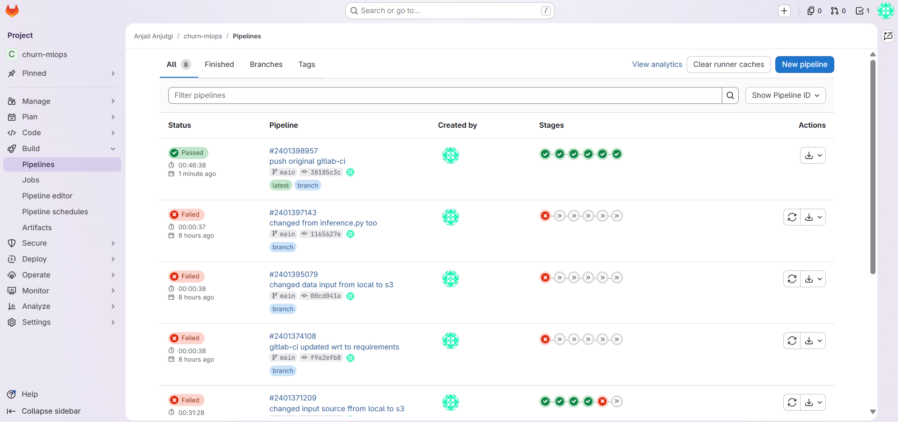
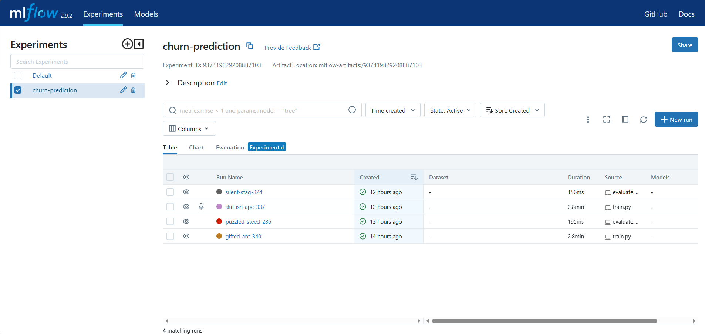
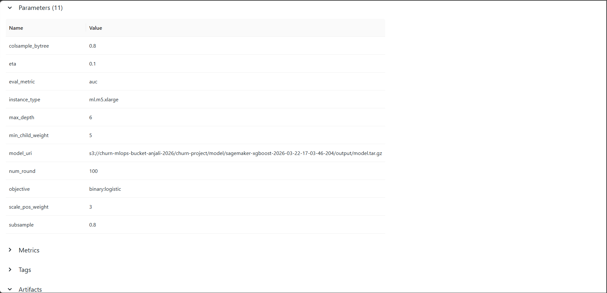
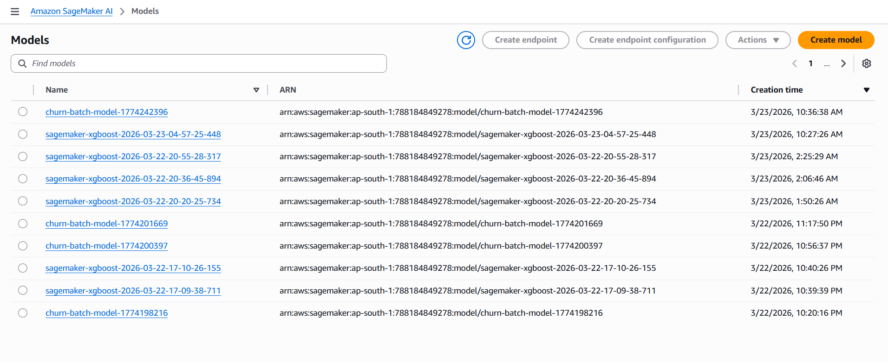
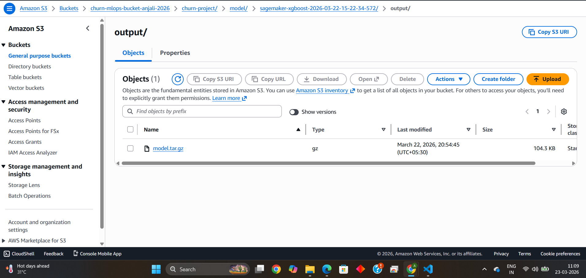
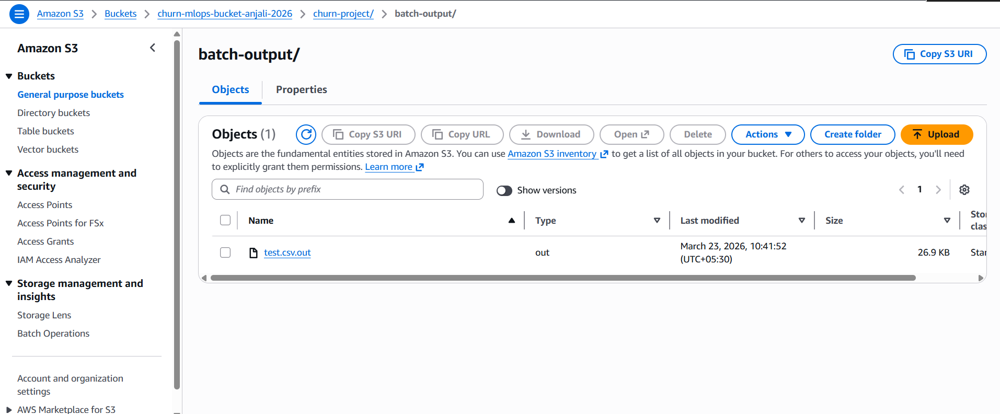
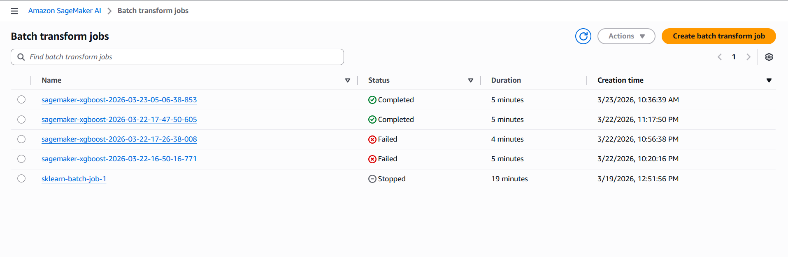
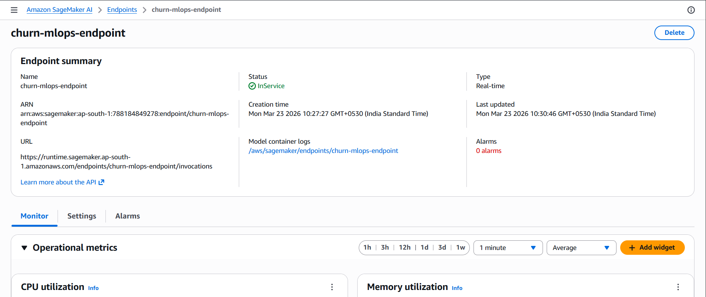

# Customer Churn Prediction — MLOps Pipeline

An end-to-end MLOps pipeline that predicts customer churn using XGBoost,
deployed on AWS SageMaker with full CI/CD automation via GitLab.



## Architecture
```
Kaggle CSV → preprocess.py → S3
                                ↓
                    SageMaker Training Job (XGBoost)
                                ↓
                         MLflow Tracking
                                ↓
                    SageMaker Real-time Endpoint
                         ↓              ↓
                  Batch Transform    Real-time Inference
```

## Tech Stack

| Tool | Purpose |
|---|---|
| AWS SageMaker | Cloud model training and deployment |
| AWS S3 | Data and model artifact storage |
| AWS IAM | Secure role-based access |
| Terraform | Infrastructure as Code |
| MLflow | Experiment tracking and logging |
| XGBoost | Gradient boosted tree model |
| GitLab CI/CD | 6-stage automated pipeline |
| Python | Preprocessing, training, inference scripts |
| pytest | Unit testing for data validation |

## Project Structure
```
churn-mlops/
├── config.yaml              # all settings in one place
├── requirements.txt         # python dependencies
├── .gitlab-ci.yml           # 6-stage CI/CD pipeline
├── src/
│   ├── preprocess.py        # data cleaning + S3 upload
│   ├── train.py             # SageMaker training + MLflow logging
│   ├── evaluate.py          # endpoint deployment + AUC evaluation
│   ├── batch_transform.py   # bulk predictions on CSV
│   └── realtime_inference.py# single prediction via live endpoint
├── tests/
│   └── test_preprocess.py   # 6 unit tests for preprocessing
├── terraform/
│   ├── main.tf              # S3 bucket + IAM role
│   └── variables.tf         # configurable variables
└── data/
    └── WA_Fn-UseC_-Telco-Customer-Churn.csv
```

## CI/CD Pipeline — 6 Stages


| Stage | Script | What it does |
|---|---|---|
| test | pytest tests/ | Runs 6 unit tests on preprocessing logic |
| preprocess | preprocess.py | Cleans data, splits train/test, uploads to S3 |
| train | train.py | Launches SageMaker XGBoost training job |
| deploy | evaluate.py | Deploys endpoint, evaluates AUC >= 0.75 |
| batch | batch_transform.py | Bulk predictions on entire test CSV |
| inference | realtime_inference.py | Single prediction via live API endpoint |

## How to Run Locally

### Prerequisites
- Python 3.10
- AWS CLI configured (`aws configure`)
- Terraform installed

### Step 1 — Clone the repo
```bash
git clone https://github.com/yourusername/churn-mlops.git
cd churn-mlops
```

### Step 2 — Create virtual environment
```bash
py -3.10 -m venv venv
venv\Scripts\activate
pip install -r requirements.txt
```

### Step 3 — Provision AWS infrastructure
```bash
cd terraform
terraform init
terraform apply
```
Copy the output `bucket_name` and `sagemaker_role_arn` into `config.yaml`.

### Step 4 — Preprocess data
```bash
python src/preprocess.py
```

### Step 5 — Train model
```bash
# Terminal 1
python -m mlflow ui

# Terminal 2
python src/train.py
```

### Step 6 — Deploy and evaluate
```bash
python src/evaluate.py
```

### Step 7 — Run predictions
```bash
python src/batch_transform.py
python src/realtime_inference.py
```

## Key Design Decisions

**Why SageMaker instead of training locally?**
SageMaker runs training on a dedicated cloud instance (`ml.m5.large`),
keeping my local machine free and making the pipeline scalable.
Training on AWS also means the same process works for any dataset size.

**Why Terraform?**
All AWS infrastructure (S3 bucket, IAM role) is created with one command
`terraform apply` and can be destroyed with `terraform destroy`.
This makes the project fully reproducible — anyone can clone and deploy.

**Why MLflow?**
Every training run logs hyperparameters and AUC score automatically.
This means I can compare experiments and know exactly which model
configuration produced the best results.

**Why an AUC threshold gate?**
If the model scores below 0.75 AUC, the endpoint is automatically deleted
and the pipeline fails. This prevents a bad model from ever reaching
production — a critical MLOps best practice.

**Batch vs real-time inference — when to use each?**
- Batch transform: use for weekly scoring of all customers at once (offline, cheap)
- Real-time endpoint: use for instant single predictions in a live application (online, fast)

## Screenshots

### GitLab CI/CD Pipeline — all 6 stages green


### MLflow Experiment Tracking



### SageMaker Training Job


### S3 Bucket Structure



### Batch Transform — bulk predictions output in S3


### Real-time Inference — live endpoint InService


## Interview Talking Points

- **Terraform** creates all AWS infra as code — reproducible with one command
- **GitLab CI** runs 6 stages automatically on every git push — zero manual steps
- **MLflow** tracks every experiment: params, metrics, model artifact location
- **AUC threshold** = quality gate that protects production from bad models
- **Batch transform** = offline bulk predictions, good for weekly customer scoring
- **Real-time endpoint** = low latency single prediction via live REST API

## Dataset

Telco Customer Churn dataset from Kaggle —
7,043 customers, 21 features, binary churn prediction target.

Source: https://www.kaggle.com/datasets/blastchar/telco-customer-churn

## Author

Your Name
[LinkedIn](https://linkedin.com/in/yourprofile) |
[GitHub](https://github.com/yourusername)
```

Save and close.

---

## Step 2 — Add your screenshots

Create the `img/` folder and add your screenshots:
```
mkdir img
```

Name your screenshot files exactly:
- `img/pipeline.png` — GitLab all 6 green stages
- `img/mlflow.png` — MLflow experiment UI
- `img/sagemaker.png` — SageMaker training job completed
- `img/s3.png` — S3 bucket showing your files

---

## Step 3 — Update README with your real details

Open `README.md` and replace:
- `yourusername` → your real GitHub username
- `yourprofile` → your real LinkedIn profile URL
- `Your Name` → your real name

---

## Step 4 — Push everything to GitHub
```
cd C:\Users\ANJALI\Desktop\proj-practice\churn-mlops
git add README.md img/
git commit -m "add README and screenshots"
git push
```

---

## Step 5 — Write your LinkedIn post

Copy and paste this, fill in the blanks:
```
Just finished building an end-to-end MLOps pipeline on AWS!

Here's what it does automatically on every git push:
✅ Runs unit tests on preprocessing
✅ Cleans data and uploads to S3
✅ Launches XGBoost training on SageMaker
✅ Deploys real-time endpoint (only if AUC >= 0.75)
✅ Runs batch predictions on entire dataset
✅ Tests live inference via API call

Stack: AWS SageMaker · S3 · Terraform · MLflow · GitLab CI/CD · XGBoost · Python

All infrastructure is provisioned with Terraform and the
entire pipeline runs automatically — zero manual steps.

GitHub: [your link here]

#MLOps #AWS #SageMaker #Terraform #MLflow #MachineLearning #GitLab #Python